# 🔗 GUIA DE INTEGRAÇÕES - RETELL MVP

## 📋 ÍNDICE

1. [Configurar Credenciais](#1-configurar-credenciais)
2. [Integração Retell.ai](#2-integração-retellai)
3. [Webhooks](#3-webhooks)
4. [Testes](#4-testes)

---

## 1. CONFIGURAR CREDENCIAIS

### 1.1 Via API (Swagger UI)

Acesse: `http://localhost:3000/api`

Navegue até a seção **config** e use os endpoints:

#### Ver Status Atual
```
GET /config/status
```

Retorna:
```json
{
  "retell": {
    "configured": false,
    "status": "not_tested"
  },
  "twilio": {
    "configured": false,
    "status": "not_tested"
  },
  "openai": {
    "configured": false,
    "status": "not_tested"
  }
}
```

#### Configurar Retell.ai
```
PATCH /config/retell
```

Body:
```json
{
  "apiKey": "key_seu_api_key_aqui"
}
```

#### Configurar Twilio
```
PATCH /config/twilio
```

Body:
```json
{
  "accountSid": "ACxxxxxxxxxxxxxxxxx",
  "authToken": "seu_auth_token",
  "phoneNumber": "+5511999999999"
}
```

#### Configurar OpenAI
```
PATCH /config/openai
```

Body:
```json
{
  "apiKey": "sk-xxxxxxxxxxxxxxxx"
}
```

### 1.2 Testar Conexões

Depois de configurar, teste cada integração:

```
POST /config/test-retell
POST /config/test-twilio
POST /config/test-openai
```

Cada teste retorna:
```json
{
  "success": true,
  "message": "Conexão OK"
}
```

---

## 2. INTEGRAÇÃO RETELL.AI

### 2.1 Criar Agente na Retell.ai

#### Via Swagger UI

Acesse: `http://localhost:3000/api`

Seção: **integrations/retell**

Endpoint: `POST /integrations/retell/agents`

#### Body de Exemplo:

```json
{
  "name": "Assistente de Vendas Premium",
  "voiceId": "11labs-Adrian",
  "llmProvider": "openai",
  "llmModel": "gpt-4",
  "systemPrompt": "Você é um vendedor experiente e prestativo. Seu objetivo é entender as necessidades do cliente e oferecer soluções personalizadas. Seja amigável, profissional e sempre busque fechar a venda.",
  "firstMessage": "Olá! Bem-vindo à nossa empresa. Meu nome é Adrian e estou aqui para ajudá-lo. Como posso auxiliar você hoje?",
  "temperature": 0.7,
  "maxTokens": 500
}
```

#### Resposta:

```json
{
  "agent_id": "retell_1733456789",
  "agent_name": "Assistente de Vendas Premium",
  "voice_id": "11labs-Adrian",
  "created_at": "2025-12-05T10:30:00.000Z",
  "simulated": true,
  "message": "Agente criado em modo simulado. Configure RETELL_API_KEY para criar agentes reais."
}
```

### 2.2 Listar Agentes Retell.ai

```
GET /integrations/retell/agents
```

### 2.3 Buscar Agente por ID

```
GET /integrations/retell/agents/{agent_id}
```

### 2.4 Deletar Agente

```
DELETE /integrations/retell/agents/{agent_id}
```

### 2.5 Criar Chamada Telefônica

```
POST /integrations/retell/calls
```

Body:
```json
{
  "agentId": "retell_1733456789",
  "toNumber": "+5511999887766",
  "fromNumber": "+5511999999999"
}
```

---

## 3. WEBHOOKS

### 3.1 Configurar Webhooks no Painel Retell.ai

Acesse o painel da Retell.ai e configure:

**Webhook URL:**
```
https://seu-dominio.com/webhooks/retell/call-events
```

**Eventos para receber:**
- ✅ call_started
- ✅ call_ended
- ✅ call_analyzed

### 3.2 Configurar Webhooks no Painel Twilio

Acesse o painel do Twilio e configure:

**Status Callback URL:**
```
https://seu-dominio.com/webhooks/twilio/call-status
```

**Incoming Call URL:**
```
https://seu-dominio.com/webhooks/twilio/incoming-call
```

### 3.3 Webhook Customizado

Crie webhooks customizados por organização:

```
POST /webhooks/custom/{organizationId}
```

Exemplo:
```
POST /webhooks/custom/demo-org-id
```

Body: (qualquer payload JSON)
```json
{
  "event": "custom_event",
  "data": {
    "foo": "bar"
  }
}
```

---

## 4. TESTES

### 4.1 Testar Fluxo Completo

#### Passo 1: Configurar Credenciais

```bash
# Via curl
curl -X PATCH http://localhost:3000/config/retell \
  -H "Content-Type: application/json" \
  -d '{"apiKey": "key_sua_chave"}'

curl -X PATCH http://localhost:3000/config/twilio \
  -H "Content-Type: application/json" \
  -d '{
    "accountSid": "ACxxxxx",
    "authToken": "token",
    "phoneNumber": "+5511999999999"
  }'
```

#### Passo 2: Criar Agente Local

```bash
curl -X POST http://localhost:3000/agents \
  -H "Content-Type: application/json" \
  -d '{
    "name": "Vendas Bot",
    "type": "inbound",
    "systemPrompt": "Você é um vendedor",
    "voiceId": "11labs-Adrian"
  }'
```

#### Passo 3: Criar Agente na Retell.ai

```bash
curl -X POST http://localhost:3000/integrations/retell/agents \
  -H "Content-Type: application/json" \
  -d '{
    "name": "Vendas Bot",
    "voiceId": "11labs-Adrian",
    "llmProvider": "openai",
    "llmModel": "gpt-4",
    "systemPrompt": "Você é um vendedor",
    "firstMessage": "Olá!"
  }'
```

#### Passo 4: Simular Webhook de Chamada

```bash
curl -X POST http://localhost:3000/webhooks/retell/call-events \
  -H "Content-Type: application/json" \
  -d '{
    "event": "call_started",
    "call": {
      "call_id": "call_12345",
      "agent_id": "agent_67890",
      "from_number": "+5511999887766",
      "to_number": "+5511999999999",
      "start_timestamp": "2025-12-05T10:30:00.000Z",
      "direction": "inbound"
    }
  }'
```

#### Passo 5: Verificar Chamada Criada

```bash
curl http://localhost:3000/calls
```

### 4.2 Testar Via Swagger UI

1. Acesse `http://localhost:3000/api`
2. Navegue até **config**
3. Configure cada integração
4. Navegue até **integrations/retell**
5. Teste criar agente
6. Navegue até **webhooks**
7. Simule eventos

---

## 5. FLUXO DE PRODUÇÃO

### 5.1 Setup Inicial

```mermaid
graph TD
    A[Configurar Credenciais] --> B[Testar Conexões]
    B --> C[Criar Agente Local]
    C --> D[Criar Agente Retell.ai]
    D --> E[Configurar Webhooks]
    E --> F[Testar Chamada]
```



### 5.2 Fluxo de Chamada Inbound

```
1. Cliente liga para número Twilio
2. Twilio envia webhook para /webhooks/twilio/incoming-call
3. Sistema cria registro de chamada
4. Sistema conecta chamada ao agente Retell.ai
5. Retell.ai envia eventos via webhook
6. Sistema atualiza registro de chamada
7. Chamada termina
8. Sistema salva transcrição e analytics
```

### 5.3 Fluxo de Chamada Outbound

```
1. Sistema cria chamada via /integrations/retell/calls
2. Retell.ai inicia chamada via Twilio
3. Retell.ai conecta ao agente
4. Eventos são enviados via webhook
5. Sistema processa e salva dados
```

---

## 6. ENDPOINTS COMPLETOS

### Config
```
GET    /config              - Ver configurações (sem secrets)
GET    /config/status       - Status das integrações
PATCH  /config/retell       - Configurar Retell.ai
PATCH  /config/twilio       - Configurar Twilio
PATCH  /config/openai       - Configurar OpenAI
POST   /config/test-retell  - Testar Retell.ai
POST   /config/test-twilio  - Testar Twilio
POST   /config/test-openai  - Testar OpenAI
```

### Integrations/Retell
```
POST   /integrations/retell/agents           - Criar agente
GET    /integrations/retell/agents           - Listar agentes
GET    /integrations/retell/agents/:id       - Buscar agente
DELETE /integrations/retell/agents/:id       - Deletar agente
POST   /integrations/retell/calls            - Criar chamada
```

### Webhooks
```
POST   /webhooks/retell/call-events          - Eventos Retell.ai
POST   /webhooks/twilio/call-status          - Status Twilio
POST   /webhooks/twilio/incoming-call        - Chamadas recebidas
POST   /webhooks/custom/:organizationId      - Webhook customizado
```

---

## 7. VARIÁVEIS DE AMBIENTE

Adicione no `.env`:

```bash
# Retell.ai
RETELL_API_KEY=key_xxxxxxxxxxxxx
RETELL_WEBHOOK_SECRET=whsec_yyyyyyy

# Twilio
TWILIO_ACCOUNT_SID=ACxxxxxxxxxxxxx
TWILIO_AUTH_TOKEN=your_auth_token
TWILIO_PHONE_NUMBER=+5511999999999

# OpenAI
OPENAI_API_KEY=sk-xxxxxxxxxxxxxxxx

# Webhooks
WEBHOOK_BASE_URL=https://seu-dominio.com
```

---

## 8. NGROK PARA DESENVOLVIMENTO LOCAL

Para testar webhooks localmente:

```bash
# Instalar ngrok
brew install ngrok  # macOS
# ou baixe de https://ngrok.com/

# Iniciar túnel
ngrok http 3000

# Usar URL gerada nos painéis:
# https://xxxx-xx-xx-xxx-xxx.ngrok.io/webhooks/retell/call-events
```

---

## 9. SEGURANÇA

### 9.1 Verificar Assinatura de Webhooks

Os webhooks da Retell.ai vêm com assinatura HMAC no header `x-retell-signature`.

Implementação em `webhooks.service.ts`:

```typescript
private verifyRetellSignature(payload: any, signature: string): boolean {
  const secret = this.config.get('RETELL_WEBHOOK_SECRET');
  const hash = crypto
    .createHmac('sha256', secret)
    .update(JSON.stringify(payload))
    .digest('hex');
  return hash === signature;
}
```

### 9.2 Rate Limiting

Adicione rate limiting nos webhooks:

```typescript
@Throttle(100, 60) // 100 requisições por minuto
@Post('retell/call-events')
async handleRetellCallEvent(...) { }
```

---

## 10. MONITORAMENTO

### 10.1 Logs

Todos os webhooks são logados automaticamente:

```typescript
this.logger.log('Recebido evento Retell.ai:', payload.event);
```

### 10.2 Verificar Chamadas

```bash
# Ver todas as chamadas
curl http://localhost:3000/calls

# Ver analytics
curl http://localhost:3000/calls/analytics
```

---

## 🎉 PRONTO!

Agora você tem:
- ✅ Endpoint para configurar credenciais
- ✅ Integração completa com Retell.ai
- ✅ Webhooks configurados
- ✅ Fluxo de chamadas funcionando

**Próximo passo: Frontend React** 🎨
